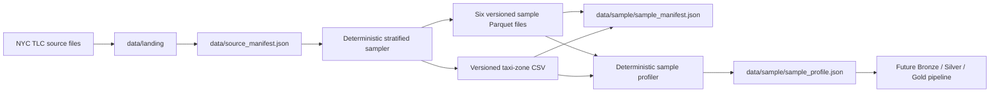

# NYC Taxi Lakehouse with PySpark and Delta Lake

A reproducible Data Engineering project based on NYC TLC Yellow Taxi data.

The project currently provides a validated source-data foundation, a
deterministic stratified sample, automated data profiling, command-line tools,
tests, and continuous integration. The future pipeline will extend this
foundation into Bronze, Silver, and Gold Delta Lake layers.

## Current status

Completed:

- local Python, PySpark, Java, and Delta Lake environment;
- acquisition and validation of NYC TLC source files;
- source manifest with row counts, schemas, sizes, and SHA-256 checksums;
- deterministic stratified sampling across six monthly Parquet files;
- versioned sample artifacts for local development and CI;
- logical checksums independent of Parquet binary serialization;
- automated deterministic sample profiling;
- atomic artifact writing and command-line interfaces;
- unit tests, Ruff checks, and GitHub Actions CI;
- CI verification of the versioned profile artifact.

Planned:

- Bronze Delta ingestion;
- Silver accepted and rejected datasets;
- explicit data-quality rules and rejection reasons;
- Gold analytical tables and business metrics;
- Databricks-compatible execution and documentation.

## Dataset

The source dataset contains NYC TLC Yellow Taxi trips from January through
June 2024.

| Metric | Value |
|---|---:|
| Source months | 6 |
| Source trip rows | 20,332,093 |
| Trip columns | 19 |
| Taxi zones | 265 |
| Versioned sample rows | 1,500 |
| Sample rows per month | 250 |

The original source files are stored under `data/landing/` and are intentionally
excluded from Git. The smaller deterministic sample is committed to the
repository so that tests and local development do not require processing more
than 20 million source rows.

## Architecture



## Deterministic sampling

The sample is partitioned by source month and quality bucket. Rows are ranked
using a SHA-256 hash derived from the source month and a canonical JSON
representation of all 19 source columns.

The process selects exactly 250 rows from every month and preserves the source
schema. It deliberately includes ordinary trips and representative quality
problems.

| Quality bucket | Rows |
|---|---:|
| `normal` | 636 |
| `passenger_missing` | 240 |
| `distance_zero` | 120 |
| `passenger_nonpositive` | 120 |
| `total_amount_negative` | 120 |
| `duration_nonpositive` | 60 |
| `passenger_over_6` | 60 |
| `total_amount_zero` | 60 |
| `pickup_outside_month` | 54 |
| `duration_over_24h` | 30 |
| **Total** | **1,500** |

Three additional buckets are reserved for synthetic test cases because they
were not sufficiently represented in the real source data:

- `pickup_zone_unknown`;
- `dropoff_zone_unknown`;
- `distance_negative`.

## Logical and binary checksums

Spark can produce physically different Parquet bytes for the same logical rows
across separate executions.

The project therefore distinguishes two integrity concepts:

- **binary SHA-256** verifies the exact bytes of the current file;
- **logical SHA-256** verifies the selected rows independently of Parquet
  serialization.

The logical checksum sorts the deterministic row hashes and hashes their ordered
sequence. Repeated generations therefore preserve the logical checksum even when
the physical Parquet checksum changes.

The sample manifest records both values.

## Sample profile

The command `taxi-lakehouse-profile-sample` generates the deterministic file
`data/sample/sample_profile.json`.

| Metric | Value |
|---|---:|
| Rows | 1,500 |
| Columns | 19 |
| Source months | 6 |
| Represented quality buckets | 10 |

Five columns contain 302 null values each:

- `passenger_count`;
- `RatecodeID`;
- `store_and_fwd_flag`;
- `congestion_surcharge`;
- `Airport_fee`.

| Numeric column | Minimum | Maximum |
|---|---:|---:|
| `passenger_count` | 0 | 9 |
| `trip_distance` | 0.0 | 233.25 |
| `total_amount` | -87.15 | 1,617.50 |

The profile also contains out-of-period timestamps ranging from 2002 to 2026.
These values are retained to exercise future data-quality rules rather than
hide problems present in the source data.

## Versioned artifacts

| Path | Purpose |
|---|---|
| `data/source_manifest.json` | Metadata and integrity information for raw sources |
| `data/sample/sample_spec.json` | Deterministic sampling contract |
| `data/sample/sample_manifest.json` | Sample metadata and checksums |
| `data/sample/sample_profile.json` | Deterministic sample profile |
| `data/sample/taxi_zone_lookup.csv` | Versioned taxi-zone reference data |
| `data/sample/yellow_tripdata_2024-*.parquet` | Six monthly sample files |

## Requirements

- Python 3.12;
- Java 17;
- PySpark 3.5.9;
- Delta Lake 3.3.2;
- pytest 9.1.1 for tests;
- Ruff 0.16.1 for linting and formatting.

## Installation

Create and activate a Python virtual environment:

```bash
python3.12 -m venv .venv
source .venv/bin/activate
python -m pip install --editable ".[dev]"
```

Verify the runtime:

```bash
python --version
java -version
python -c "import pyspark; print(pyspark.__version__)"
```

## Commands

Display the available options:

```bash
taxi-lakehouse-download --help
taxi-lakehouse-generate-sample --help
taxi-lakehouse-profile-sample --help
```

Generate the deterministic sample from the local landing files:

```bash
taxi-lakehouse-generate-sample
```

Regenerate the deterministic profile:

```bash
taxi-lakehouse-profile-sample
git diff --exit-code -- data/sample/sample_profile.json
```

## Tests and code quality

Run the complete test suite:

```bash
pytest -q
```

Run linting and formatting checks:

```bash
ruff check .
ruff format --check .
```

At the current project stage, the suite contains 79 tests.

## Continuous integration

GitHub Actions runs on pull requests targeting `main` and on pushes to `main`.

The workflow:

1. installs Java 17 and Python 3.12;
2. installs the project and development dependencies;
3. runs Ruff lint checks;
4. verifies Ruff formatting;
5. runs the complete pytest suite;
6. regenerates `sample_profile.json`;
7. fails if the generated profile differs from the committed artifact.

## Project structure

```text
.
├── .github/workflows/ci.yaml
├── data
│   ├── landing/                     # Local source files excluded from Git
│   ├── source_manifest.json
│   └── sample
│       ├── sample_spec.json
│       ├── sample_manifest.json
│       ├── sample_profile.json
│       ├── taxi_zone_lookup.csv
│       └── yellow_tripdata_2024-*.parquet
├── src/taxi_lakehouse
│   ├── cli.py
│   ├── data_acquisition.py
│   ├── sample_artifacts.py
│   ├── sample_generation.py
│   ├── sample_manifest.py
│   ├── sample_orchestration.py
│   ├── sample_pipeline.py
│   ├── sample_profile_artifact.py
│   ├── sample_profiling.py
│   └── sample_specification.py
├── tests/unit
├── pyproject.toml
└── README.md
```

The package separates acquisition, sampling, orchestration, artifact writing,
manifest generation, and profiling so that each component can be tested
independently.

## Roadmap

### Phase 1 — Source foundation

- [x] Acquire and audit the source files.
- [x] Generate a versioned source manifest.
- [x] Build a deterministic stratified sample.
- [x] Generate reproducible sample metadata and profiling artifacts.
- [x] Verify the profile artifact in continuous integration.

### Phase 2 — Bronze layer

- [ ] Ingest raw trip and taxi-zone data into Delta tables.
- [ ] Preserve source metadata and ingestion lineage.
- [ ] Support idempotent and incremental execution.

### Phase 3 — Silver layer

- [ ] Standardize schemas, timestamps, and numeric values.
- [ ] Apply explicit data-quality rules.
- [ ] Separate accepted and rejected records.
- [ ] Record rejection reasons and quality metrics.

### Phase 4 — Gold layer

- [ ] Build analytical tables and business KPIs.
- [ ] Aggregate trips by date, location, and payment type.
- [ ] Document Spark SQL queries and validation results.

### Phase 5 — Databricks delivery

- [ ] Adapt the pipeline for Databricks Free Edition.
- [ ] Add notebooks or jobs for end-to-end execution.
- [ ] Document the final architecture and operational workflow.
