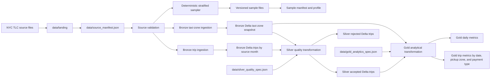

# NYC Taxi Lakehouse with PySpark and Delta Lake

A reproducible Data Engineering project based on NYC TLC Yellow Taxi data.

The project currently provides a validated source-data foundation, a
deterministic stratified sample, automated data profiling, command-line tools,
tests, continuous integration, and production-style Bronze, Silver, and Gold
Delta Lake layers. The remaining project phase focuses on
Databricks-compatible delivery.

## Current status

Completed:

- local Python, PySpark, Java, and Delta Lake environment;
- acquisition and validation of NYC TLC source files;
- source manifest with row counts, schemas, sizes, and SHA-256 checksums;
- deterministic stratified sampling across six monthly Parquet files;
- versioned sample artifacts for local development and CI;
- logical checksums independent of Parquet binary serialization;
- automated deterministic sample profiling;
- atomic artifact writing and command-line interfaces;
- unit tests, Ruff checks, and GitHub Actions CI;
- CI verification of the versioned profile artifact;
- Bronze Delta ingestion for all six monthly trip sources;
- Bronze taxi-zone snapshot ingestion;
- source-file, checksum, source-month, and UTC ingestion lineage;
- idempotent monthly partition replacement for trip data;
- versioned Silver data-quality contract;
- explicit rejection rules and retained quality flags;
- Silver accepted and rejected Delta datasets;
- multiple rejection reasons and quality flags per trip;
- automatic Bronze source-month discovery for Silver processing;
- idempotent monthly Silver partition replacement;
- memory-conscious local Silver execution with bounded Spark parallelism;
- end-to-end Silver validation across all 20,332,093 trip rows;
- versioned Gold analytical contract;
- Gold metrics aggregated by date, pickup zone, and payment type;
- daily Gold business metrics;
- idempotent monthly Gold Delta replacement;
- validated preservation of all 20,325,497 accepted Silver trips;
- versioned Spark SQL analytical and validation queries.

Planned:

- Databricks-compatible execution and documentation.

## Dataset

The source dataset contains NYC TLC Yellow Taxi trips from January through
June 2024.

| Metric | Value |
|---|---:|
| Source months | 6 |
| Source trip rows | 20,332,093 |
| Trip columns | 19 |
| Taxi zones | 265 |
| Versioned sample rows | 1,500 |
| Sample rows per month | 250 |

The original source files are stored under `data/landing/` and are intentionally
excluded from Git. The smaller deterministic sample is committed to the
repository so that tests and local development do not require processing more
than 20 million source rows.

## Architecture



## Deterministic sampling

The sample is partitioned by source month and quality bucket. Rows are ranked
using a SHA-256 hash derived from the source month and a canonical JSON
representation of all 19 source columns.

The process selects exactly 250 rows from every month and preserves the source
schema. It deliberately includes ordinary trips and representative quality
problems.

| Quality bucket | Rows |
|---|---:|
| `normal` | 636 |
| `passenger_missing` | 240 |
| `distance_zero` | 120 |
| `passenger_nonpositive` | 120 |
| `total_amount_negative` | 120 |
| `duration_nonpositive` | 60 |
| `passenger_over_6` | 60 |
| `total_amount_zero` | 60 |
| `pickup_outside_month` | 54 |
| `duration_over_24h` | 30 |
| **Total** | **1,500** |

Three additional buckets are reserved for synthetic test cases because they
were not sufficiently represented in the real source data:

- `pickup_zone_unknown`;
- `dropoff_zone_unknown`;
- `distance_negative`.

## Logical and binary checksums

Spark can produce physically different Parquet bytes for the same logical rows
across separate executions.

The project therefore distinguishes two integrity concepts:

- **binary SHA-256** verifies the exact bytes of the current file;
- **logical SHA-256** verifies the selected rows independently of Parquet
  serialization.

The logical checksum sorts the deterministic row hashes and hashes their ordered
sequence. Repeated generations therefore preserve the logical checksum even when
the physical Parquet checksum changes.

The sample manifest records both values.

## Sample profile

The command `taxi-lakehouse-profile-sample` generates the deterministic file
`data/sample/sample_profile.json`.

| Metric | Value |
|---|---:|
| Rows | 1,500 |
| Columns | 19 |
| Source months | 6 |
| Represented quality buckets | 10 |

Five columns contain 302 null values each:

- `passenger_count`;
- `RatecodeID`;
- `store_and_fwd_flag`;
- `congestion_surcharge`;
- `Airport_fee`.

| Numeric column | Minimum | Maximum |
|---|---:|---:|
| `passenger_count` | 0 | 9 |
| `trip_distance` | 0.0 | 233.25 |
| `total_amount` | -87.15 | 1,617.50 |

The profile also contains out-of-period timestamps ranging from 2002 to 2026.
These values are retained to exercise the Silver data-quality rules rather than
hide problems present in the source data.

## Versioned artifacts

| Path | Purpose |
|---|---|
| `data/source_manifest.json` | Metadata and integrity information for raw sources |
| `data/silver_quality_spec.json` | Versioned Silver data-quality contract |
| `data/gold_analytics_spec.json` | Versioned Gold analytical contract |
| `data/sample/sample_spec.json` | Deterministic sampling contract |
| `data/sample/sample_manifest.json` | Sample metadata and checksums |
| `data/sample/sample_profile.json` | Deterministic sample profile |
| `data/sample/taxi_zone_lookup.csv` | Versioned taxi-zone reference data |
| `data/sample/yellow_tripdata_2024-*.parquet` | Six monthly sample files |

## Bronze Delta layer

The command `taxi-lakehouse-ingest-bronze` validates the source manifest and
loads the complete local dataset into two Delta Lake tables.

| Delta table | Default path | Rows | Columns |
|---|---|---:|---:|
| Yellow Taxi trips | `data/lakehouse/bronze/yellow_taxi_trips` | 20,332,093 | 24 |
| Taxi zones | `data/lakehouse/bronze/taxi_zones` | 265 | 9 |

The 19 source trip columns are preserved without business cleaning. Five
technical columns provide ingestion lineage:

- `_source_file`;
- `_source_kind`;
- `_source_month`;
- `_source_sha256`;
- `_ingested_at_utc`.

The trip table is partitioned by `_source_month`. Each execution replaces only
the corresponding monthly partitions through Delta Lake `replaceWhere`
predicates. The taxi-zone table is treated as a complete reference snapshot and
is replaced atomically.

| Source month | Bronze trip rows |
|---|---:|
| 2024-01 | 2,964,624 |
| 2024-02 | 3,007,526 |
| 2024-03 | 3,582,628 |
| 2024-04 | 3,514,289 |
| 2024-05 | 3,723,833 |
| 2024-06 | 3,539,193 |
| **Total** | **20,332,093** |

Source DataFrames are cached for one count-and-write cycle and released
synchronously before the next source is processed. Repeated executions
therefore preserve the active row counts instead of appending duplicates.

The generated Delta tables are local runtime artifacts and are excluded from
Git through the `data/lakehouse/` ignore rule.

## Silver Delta layer

The command `taxi-lakehouse-build-silver` reads the Bronze trip and taxi-zone
Delta tables and applies the versioned contract in
`data/silver_quality_spec.json`.

Each trip keeps all 24 Bronze columns and receives two additional array columns:

- `_rejection_reasons` records every matching hard rejection rule;
- `_quality_flags` records every matching retained quality condition.

A row is written to the rejected table when `_rejection_reasons` contains at
least one value. Otherwise, it is written to the accepted table. Multiple
rejection reasons and quality flags can therefore be retained on the same trip.

Hard rejection rules:

- `pickup_zone_unknown`;
- `dropoff_zone_unknown`;
- `distance_negative`;
- `duration_nonpositive`;
- `duration_over_24h`;
- `pickup_outside_month`;
- `passenger_over_6`.

Retained quality flags:

- `total_amount_zero`;
- `total_amount_negative`;
- `passenger_nonpositive`;
- `distance_zero`;
- `passenger_missing`.

| Delta table | Default path | Active rows | Columns |
|---|---|---:|---:|
| Accepted trips | `data/lakehouse/silver/yellow_taxi_trips_accepted` | 20,325,497 | 26 |
| Rejected trips | `data/lakehouse/silver/yellow_taxi_trips_rejected` | 6,596 | 26 |

Both tables are partitioned by `_source_month` and use Delta Lake
`replaceWhere` predicates for idempotent monthly replacement.

| Source month | Accepted | Rejected | Total |
|---|---:|---:|---:|
| 2024-01 | 2,963,660 | 964 | 2,964,624 |
| 2024-02 | 3,006,676 | 850 | 3,007,526 |
| 2024-03 | 3,581,438 | 1,190 | 3,582,628 |
| 2024-04 | 3,513,144 | 1,145 | 3,514,289 |
| 2024-05 | 3,722,613 | 1,220 | 3,723,833 |
| 2024-06 | 3,537,966 | 1,227 | 3,539,193 |
| **Total** | **20,325,497** | **6,596** | **20,332,093** |

The active Delta state was validated independently after the complete build:
all six source months are present, accepted and rejected counts conserve the
20,332,093 Bronze trip rows, accepted rows have no rejection reasons, and every
rejected row has at least one rejection reason.

Local Silver execution uses two Spark worker threads to keep Delta write
parallelism compatible with the memory available in the development
environment.

## Gold Delta layer

The command `taxi-lakehouse-build-gold` reads accepted Silver trips and the
Bronze taxi-zone reference, then applies the versioned analytical contract in
`data/gold_analytics_spec.json`.

Two analytical Delta tables are produced:

| Delta table | Default path | Active rows |
|---|---|---:|
| Trip metrics | `data/lakehouse/gold/trip_metrics_by_date_pickup_zone_payment` | 128,335 |
| Daily metrics | `data/lakehouse/gold/daily_trip_metrics` | 182 |

The trip-metrics grain is:

- `_source_month`;
- `pickup_date`;
- `pickup_location_id`;
- `payment_type`.

Pickup geography is enriched from the Bronze taxi-zone reference through
`pickup_borough`, `pickup_zone`, and `pickup_service_zone`.

The daily table uses the simpler grain `_source_month` plus `pickup_date`.

Both outputs calculate the same nine business metrics:

- `trip_count`;
- `quality_flagged_trip_count`;
- `trip_distance_sum`;
- `trip_distance_avg`;
- `trip_duration_minutes_avg`;
- `fare_amount_sum`;
- `tip_amount_sum`;
- `total_amount_sum`;
- `total_amount_avg`.

The Gold build validates that the taxi-zone reference is non-empty and that
`LocationID` values are non-null and unique before analytical joins are
performed. Both Gold tables are partitioned by `_source_month` and replace only
the requested monthly partition through Delta Lake `replaceWhere`.

The complete January-through-June 2024 build produced:

| Source month | Trip-metric rows | Daily rows |
|---|---:|---:|
| 2024-01 | 20,356 | 31 |
| 2024-02 | 19,296 | 29 |
| 2024-03 | 22,378 | 31 |
| 2024-04 | 21,602 | 30 |
| 2024-05 | 22,745 | 31 |
| 2024-06 | 21,958 | 30 |
| **Total** | **128,335** | **182** |

Independent validation confirmed that both analytical tables preserve exactly
20,325,497 accepted Silver trips when `trip_count` is summed. They also preserve
the same 2,657,576 accepted trips carrying at least one retained quality flag.
No duplicate analytical grains or null grain values were found.

The versioned file `sql/gold_analytics_queries.sql` contains Spark SQL examples
for:

- daily trip activity and revenue;
- highest-volume pickup zones;
- metrics by TLC payment-type code;
- monthly retained-quality-flag rates;
- row-preservation validation;
- analytical-grain uniqueness validation.

All eight SQL statements in the file, including the two Delta temporary-view
definitions, were executed successfully against the complete local Gold layer.

Local Gold execution uses two Spark worker threads to keep aggregation and
Delta-write parallelism bounded in the development environment.

## Requirements

- Python 3.12;
- Java 17;
- PySpark 3.5.9;
- Delta Lake 3.3.2;
- pytest 9.1.1 for tests;
- Ruff 0.16.1 for linting and formatting.

## Installation

Create and activate a Python virtual environment:

```bash
python3.12 -m venv .venv
source .venv/bin/activate
python -m pip install --editable ".[dev]"
```

Verify the runtime:

```bash
python --version
java -version
python -c "import pyspark; print(pyspark.__version__)"
```

## Commands

Display the available options:

```bash
taxi-lakehouse-download --help
taxi-lakehouse-generate-sample --help
taxi-lakehouse-profile-sample --help
taxi-lakehouse-ingest-bronze --help
taxi-lakehouse-build-silver --help
taxi-lakehouse-build-gold --help
```

Generate the deterministic sample from the local landing files:

```bash
taxi-lakehouse-generate-sample
```

Regenerate the deterministic profile:

```bash
taxi-lakehouse-profile-sample
git diff --exit-code -- data/sample/sample_profile.json
```

Ingest the validated landing files into the local Bronze Delta layer:

```bash
taxi-lakehouse-ingest-bronze
```

Override the default source or destination paths when required:

```bash
taxi-lakehouse-ingest-bronze \
  --manifest data/source_manifest.json \
  --landing-dir data/landing \
  --bronze-root data/lakehouse/bronze
```

Build the Silver accepted and rejected Delta tables from Bronze:

```bash
taxi-lakehouse-build-silver
```

Override the default Silver quality specification when required:

```bash
taxi-lakehouse-build-silver \
  --specification data/silver_quality_spec.json
```

Build the Gold analytical Delta tables from accepted Silver trips:

```bash
taxi-lakehouse-build-gold
```

Override the default Gold analytical specification when required:

```bash
taxi-lakehouse-build-gold \
  --specification data/gold_analytics_spec.json
```

## Tests and code quality

Run the complete test suite:

```bash
pytest -q
```

Run linting and formatting checks:

```bash
ruff check .
ruff format --check .
```

At the current project stage, the suite contains 177 tests.

## Continuous integration

GitHub Actions runs on pull requests targeting `main` and on pushes to `main`.

The workflow:

1. installs Java 17 and Python 3.12;
2. installs the project and development dependencies;
3. runs Ruff lint checks;
4. verifies Ruff formatting;
5. runs the complete pytest suite;
6. regenerates `sample_profile.json`;
7. fails if the generated profile differs from the committed artifact.

## Project structure

```text
.
├── .github/workflows/ci.yaml
├── data
│   ├── landing/                     # Local source files excluded from Git
│   ├── lakehouse/                   # Local Delta tables excluded from Git
│   │   ├── bronze/
│   │   ├── silver/
│   │   └── gold/
│   ├── source_manifest.json
│   ├── silver_quality_spec.json
│   ├── gold_analytics_spec.json
│   └── sample
│       ├── sample_spec.json
│       ├── sample_manifest.json
│       ├── sample_profile.json
│       ├── taxi_zone_lookup.csv
│       └── yellow_tripdata_2024-*.parquet
├── src/taxi_lakehouse
│   ├── bronze_cli.py
│   ├── bronze_loading.py
│   ├── bronze_orchestration.py
│   ├── bronze_schemas.py
│   ├── bronze_sources.py
│   ├── bronze_writing.py
│   ├── cli.py
│   ├── data_acquisition.py
│   ├── quality_rules.py
│   ├── sample_artifacts.py
│   ├── sample_generation.py
│   ├── sample_manifest.py
│   ├── sample_orchestration.py
│   ├── sample_pipeline.py
│   ├── sample_profile_artifact.py
│   ├── sample_profiling.py
│   ├── sample_specification.py
│   ├── silver_cli.py
│   ├── silver_loading.py
│   ├── silver_orchestration.py
│   ├── silver_quality_specification.py
│   ├── silver_transformation.py
│   ├── silver_writing.py
│   ├── gold_analytics_specification.py
│   ├── gold_cli.py
│   ├── gold_loading.py
│   ├── gold_orchestration.py
│   ├── gold_transformation.py
│   ├── gold_writing.py
│   └── spark_session.py
├── sql
│   └── gold_analytics_queries.sql
├── tests
│   ├── integration/
│   └── unit/
├── pyproject.toml
└── README.md
```

The package separates acquisition, sampling, profiling, shared Spark session
construction, Bronze ingestion, shared quality rules, Silver specification
loading, quality transformation, Gold analytics, Delta writing, orchestration,
and command-line execution so that each component can be tested independently.

## Roadmap

### Phase 1 — Source foundation

- [x] Acquire and audit the source files.
- [x] Generate a versioned source manifest.
- [x] Build a deterministic stratified sample.
- [x] Generate reproducible sample metadata and profiling artifacts.
- [x] Verify the profile artifact in continuous integration.

### Phase 2 — Bronze layer

- [x] Ingest raw trip and taxi-zone data into Delta tables.
- [x] Preserve source metadata and ingestion lineage.
- [x] Support idempotent and incremental execution.

### Phase 3 — Silver layer

- [x] Define a versioned Silver data-quality contract.
- [x] Apply explicit rejection rules and retained quality flags.
- [x] Separate accepted and rejected records.
- [x] Preserve multiple rejection reasons and quality flags per trip.
- [x] Support idempotent monthly Delta replacement.
- [x] Validate the complete Silver layer across all 20,332,093 trip rows.

### Phase 4 — Gold layer

- [x] Build analytical tables and business KPIs.
- [x] Aggregate trips by date, pickup location, and payment type.
- [x] Document Spark SQL queries and validation results.

### Phase 5 — Databricks delivery

- [ ] Adapt the pipeline for Databricks Free Edition.
- [ ] Add notebooks or jobs for end-to-end execution.
- [ ] Document the final architecture and operational workflow.
